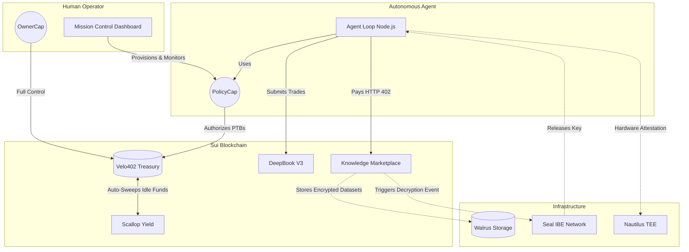
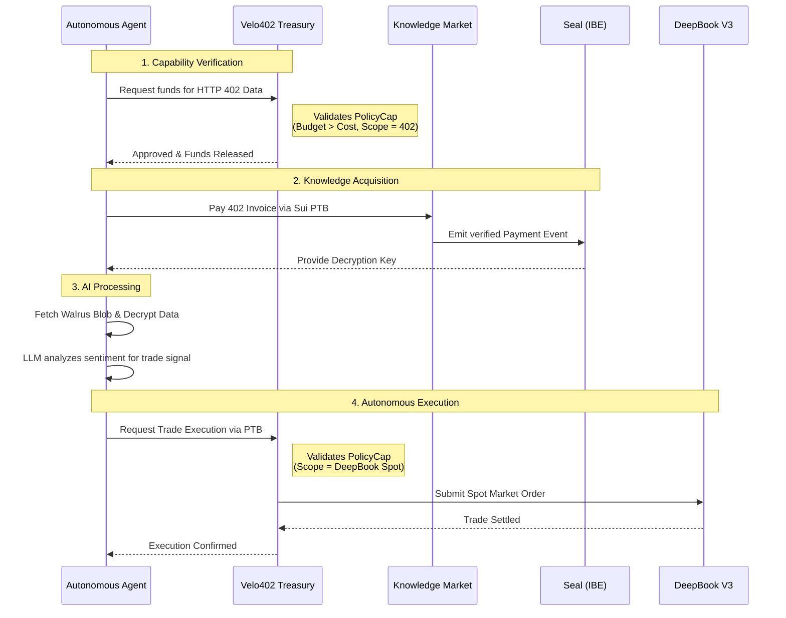

<div align="center">
  
  <h1>Velo402</h1>
  <p><em>The Wallet That Lets AI Agents Spend Without Ever Being Trusted — and Earns While It Waits</em></p>
</div>

Velo402 is a Sui-native capability wallet, encrypted knowledge marketplace, autonomous trading engine, and idle-capital yield layer built end-to-end on the live **2026 Sui Stack** (Sui, Seal, Walrus, Nautilus, DeepBook Spot/Margin/Predict, and Scallop).

> **Hackathon:** Sui Overflow 2026 (`overflow.sui.io`)  
> **Submission Track:** The Agentic Web (Core Track)  
> **Cross-filed bounties:** DeepBook Specialized Track, Walrus Specialized Track  

---

## 🛑 The Problem
If you give an AI Agent a private key, it can be prompt-injected or hallucinate and drain your entire wallet. If you don't give an AI Agent a private key, it cannot autonomously pay for data (402) or execute trades, defeating the point of an autonomous agent.

## 💡 The Solution
**Velo402 decouples *funding* from *spending*.** 

The human (OwnerCap holder) locks funds in an on-chain Treasury. The Agent receives a dynamically generated **PolicyCap** (an object proving its right to spend from the Treasury). 

The Agent can only execute transactions (PTBs) that pass the **PolicyCap** checks on-chain:
1. **Budget limits:** Hard caps on spend (e.g., Max 5 SUI total).
2. **Scope limits:** Protocol-level whitelisting (e.g., Can buy 402 Data and trade DeepBook Spot, but Margin is blocked).
3. **Hardware attestation:** TEE verification requiring a valid Nautilus PCR0 hash before execution.
4. **Time expiration:** Automatically burns after a set epoch.

Meanwhile, any funds sitting idle in the Treasury are automatically swept into **Scallop**, earning continuous yield to offset the agent's operational costs.

---

## 🏛️ System Architecture

Velo402 uses Sui's Object Capability model to create an impenetrable sandbox around the AI agent.



---

## 🔄 Core Workflow Diagram

Below is the sequence of how an Agent autonomously buys data, decrypts it, and uses it to execute a trade—all bounded by its PolicyCap.



---

## 🛠️ Technology Stack Integrations

| Protocol | Implementation Details |
|---|---|
| **Sui Move** | Core contracts (`velo_wallet`, `knowledge_policy`, `decision_gate`) utilizing Object Capabilities (OwnerCap, PolicyCap) for sub-millisecond, fine-grained authorization. |
| **Walrus** | Stores the heavy, encrypted proprietary datasets that the agent purchases on the Knowledge Marketplace. |
| **Seal** | Threshold Identity-Based Encryption (IBE). The agent pays the 402 invoice, emitting an on-chain event. Seal nodes verify the payment and provide the decryption key directly to the agent. No centralized gatekeeper. |
| **DeepBook V3** | The high-frequency trading engine. The agent executes Spot, Margin, and Predict trades autonomously based on the sentiment data it ingests. |
| **Scallop** | The yield layer. Unused capital sitting in the agent's Treasury is automatically swept into Scallop pools to earn passive interest. |
| **Nautilus** | Trusted Execution Environments (TEE). The PolicyCap can optionally demand that the agent runs inside a secure enclave by verifying a SHA-384 PCR0 hash on-chain. |

---

## 📂 Project Structure

* `/move` — The core Sui smart contracts (`Treasury`, `PolicyCap`, `Marketplace`).
* `/app` — The Next.js Mission Control dashboard (React, TypeScript, Tailwind).
* `/app/agent` — The autonomous Node.js AI agent loop (`agent-runner.ts`).
* `/app/agent/sdk` — The `@velo402/sdk` client library for other agents to easily hook into Velo402 contracts.

---

## 🚀 Running Locally

1. **Start the Next.js Mission Control Dashboard:**
```bash
cd app
npm install
npm run dev
```

2. **Run the Autonomous Agent:**
```bash
cd app
npm run start:agent
```

---
*Built for Sui Overflow 2026. See `FINAL_REPORT.md` (if provided) for deeper architectural dives.*
