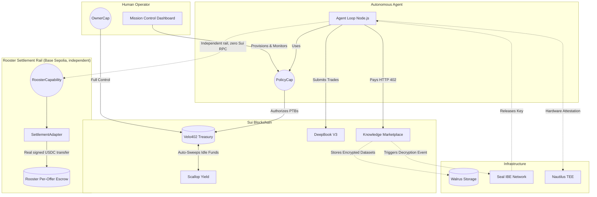
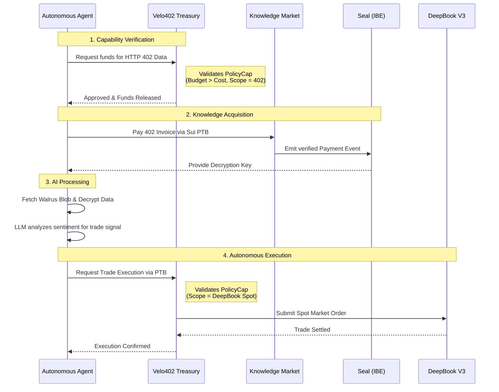
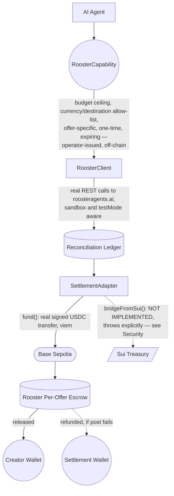
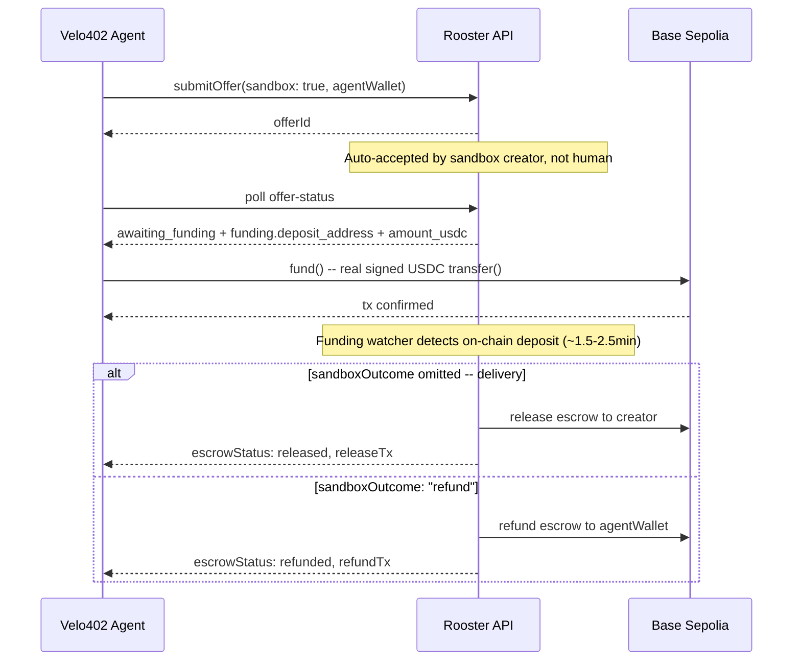

<div align="center">
  
  <h1>Velo402</h1>
  <p><em>The Wallet That Lets AI Agents Spend Without Ever Being Trusted — and Earns While It Waits</em></p>
</div>

Velo402 is a Sui-native capability wallet, encrypted knowledge marketplace, autonomous trading engine, and idle-capital yield layer built end-to-end on the live **2026 Sui Stack** (Sui, Seal, Walrus, Nautilus, DeepBook Spot/Margin/Predict, and Scallop).

> **Hackathon:** Sui Overflow 2026 (`overflow.sui.io`)  
> **Submission Track:** The Agentic Web (Core Track)  
> **Cross-filed bounties:** DeepBook Specialized Track, Walrus Specialized Track  

---

## 🛑 The Problem
If you give an AI Agent a private key, it can be prompt-injected or hallucinate and drain your entire wallet. If you don't give an AI Agent a private key, it cannot autonomously pay for data (402) or execute trades, defeating the point of an autonomous agent.

## 💡 The Solution
**Velo402 decouples *funding* from *spending*.** 

The human (OwnerCap holder) locks funds in an on-chain Treasury. The Agent receives a dynamically generated **PolicyCap** (an object proving its right to spend from the Treasury). 

The Agent can only execute transactions (PTBs) that pass the **PolicyCap** checks on-chain:
1. **Budget limits:** Hard caps on spend (e.g., Max 5 SUI total).
2. **Scope limits:** Protocol-level whitelisting (e.g., Can buy 402 Data and trade DeepBook Spot, but Margin is blocked).
3. **Hardware attestation:** TEE verification requiring a valid Nautilus PCR0 hash before execution.
4. **Time expiration:** Automatically burns after a set epoch.

Meanwhile, any funds sitting idle in the Treasury are automatically swept into **Scallop**, earning continuous yield to offset the agent's operational costs.

---

## 🏛️ System Architecture

Velo402 uses Sui's Object Capability model to create an impenetrable sandbox around the AI agent.


```mermaid
graph TD
    subgraph Human Operator
        A[Mission Control Dashboard]
        B((OwnerCap))
    end

    subgraph Autonomous Agent
        C[Agent Loop Node.js]
        D((PolicyCap))
    end

    subgraph Sui Blockchain
        E[(Velo402 Treasury)]
        F[DeepBook V3]
        G[Scallop Yield]
        H[Knowledge Marketplace]
    end

    subgraph Infrastructure
        I[(Walrus Storage)]
        J[Seal IBE Network]
        K[Nautilus TEE]
    end

    subgraph "Rooster Settlement Rail (Base Sepolia, independent)"
        L((RoosterCapability))
        M[SettlementAdapter]
        N[(Rooster Per-Offer Escrow)]
    end

    A -->|Provisions & Monitors| D
    B -->|Full Control| E
    C -->|Uses| D
    D -->|Authorizes PTBs| E
    
    E <-->|Auto-Sweeps Idle Funds| G
    
    C -->|Pays HTTP 402| H
    C -->|Submits Trades| F
    
    H -.->|Stores Encrypted Datasets| I
    H -.->|Triggers Decryption Event| J
    J -.->|Releases Key| C
    
    C -.->|Hardware Attestation| K

    C -.->|"Independent rail, zero Sui RPC"| L
    L --> M
    M -->|Real signed USDC transfer| N
```

---

## 🔄 Core Workflow Diagram

Below is the sequence of how an Agent autonomously buys data, decrypts it, and uses it to execute a trade—all bounded by its PolicyCap.


```mermaid
sequenceDiagram
    participant Agent as Autonomous Agent
    participant Velo as Velo402 Treasury
    participant Market as Knowledge Market
    participant Seal as Seal (IBE)
    participant DeepBook as DeepBook V3

    Note over Agent,Velo: 1. Capability Verification
    Agent->>Velo: Request funds for HTTP 402 Data
    Note right of Velo: Validates PolicyCap<br/>(Budget > Cost, Scope = 402)
    Velo-->>Agent: Approved & Funds Released
    
    Note over Agent,Seal: 2. Knowledge Acquisition
    Agent->>Market: Pay 402 Invoice via Sui PTB
    Market->>Seal: Emit verified Payment Event
    Seal-->>Agent: Provide Decryption Key
    
    Note over Agent,Agent: 3. AI Processing
    Agent->>Agent: Fetch Walrus Blob & Decrypt Data
    Agent->>Agent: LLM analyzes sentiment for trade signal
    
    Note over Agent,DeepBook: 4. Autonomous Execution
    Agent->>Velo: Request Trade Execution via PTB
    Note right of Velo: Validates PolicyCap<br/>(Scope = DeepBook Spot)
    Velo->>DeepBook: Submit Spot Market Order
    DeepBook-->>Velo: Trade Settled
    Velo-->>Agent: Execution Confirmed
```

---

## 🛠️ Technology Stack Integrations

| Protocol | Implementation Details |
|---|---|
| **Sui Move** | Core contracts (`velo_wallet`, `knowledge_policy`, `decision_gate`) utilizing Object Capabilities (OwnerCap, PolicyCap) for sub-millisecond, fine-grained authorization. |
| **Walrus** | Stores the heavy, encrypted proprietary datasets that the agent purchases on the Knowledge Marketplace. |
| **Seal** | Threshold Identity-Based Encryption (IBE). The agent pays the 402 invoice, emitting an on-chain event. Seal nodes verify the payment and provide the decryption key directly to the agent. No centralized gatekeeper. |
| **DeepBook V3** | The high-frequency trading engine. The agent executes Spot, Margin, and Predict trades autonomously based on the sentiment data it ingests. |
| **Scallop** | The yield layer. Unused capital sitting in the agent's Treasury is automatically swept into Scallop pools to earn passive interest. |
| **Nautilus** | Trusted Execution Environments (TEE). The PolicyCap can optionally demand that the agent runs inside a secure enclave by verifying a SHA-384 PCR0 hash on-chain. |

---

## 📂 Project Structure

* `/move` — The core Sui smart contracts (`Treasury`, `PolicyCap`, `Marketplace`).
* `/app` — The Next.js Mission Control dashboard (React, TypeScript, Tailwind).
* `/app/agent` — The autonomous Node.js AI agent loop (`agent-runner.ts`).
* `/app/agent/sdk` — The `@velo402/sdk` client library for other agents to easily hook into Velo402 contracts.

---

## 🚀 Running Locally

This project's package manager is **pnpm** (`pnpm-lock.yaml` is the tracked lockfile; Vercel's build uses pnpm exclusively). Running `npm install` instead generates a stray `package-lock.json` and leaves `pnpm-lock.yaml` stale, which breaks Vercel's `pnpm install --frozen-lockfile` build step.

1. **Start the Next.js Mission Control Dashboard:**
```bash
cd app
pnpm install
pnpm dev
```

2. **Run the Autonomous Agent:**
```bash
cd app
pnpm start:agent
```

---

## 🐓 Rooster Agents Integration

**Velo402 authorization is separate from blockchain settlement.** This section documents an additional, independent funding rail built alongside the Sui-native wallet above — it does not replace, weaken, or depend on the Sui contracts described earlier in this README. Nothing in this rail touches `velo_wallet`, `Treasury`, `PolicyCap`, or `AGENT_PRIVATE_KEY`.

### 1. What is Rooster, and where this stands

[Rooster Agents](https://roosteragents.ai/agent-economy/) runs a marketplace where AI agents hire real human creators to post sponsored content (Instagram, TikTok, YouTube, X, etc.). An agent submits an offer, a human personally accepts/rejects/counters it (no auto-approval, ever), an accepted offer is funded into a per-offer escrow, the creator posts, the post is verified live, and escrow releases — settling in **USDC on Base**.

Velo402 is registered as **Founding Agent #2** on Rooster's marketplace — this is a live partnership in progress, not a hypothetical integration target. See [§4 Partnership terms](#4-partnership-terms) for the commercial structure both sides agreed to.

### 2. Why Velo402 integrates with it

Rooster wants Velo402 to become a supported funding rail so agents that already hold Velo402 authorization can pay human creators without a human re-approving every individual post. This is prep work for a 90-day Base Sepolia pilot — a commercial arrangement, not a change to Velo402's core Sui wallet.

### 3. Architecture


```mermaid
flowchart TD
    A[AI Agent] --> B((RoosterCapability))
    B -->|"budget ceiling, currency/destination allow-list,<br/>offer-specific, one-time, expiring —<br/>operator-issued, off-chain"| C[RoosterClient]
    C -->|"real REST calls to roosteragents.ai,<br/>sandbox and testMode aware"| D[(Reconciliation Ledger)]
    D --> E[SettlementAdapter]
    E -->|"fund(): real signed USDC transfer, viem"| F([Base Sepolia])
    E -.->|"bridgeFromSui(): NOT IMPLEMENTED,<br/>throws explicitly — see Security"| G[/Sui Treasury/]
    F --> H[(Rooster Per-Offer Escrow)]
    H -->|released| I((Creator Wallet))
    H -.->|"refunded, if post fails"| J((Settlement Wallet))
```

This rail makes **zero Sui RPC calls**. `RoosterCapability` mirrors Velo402's on-chain trust shape (operator issues a budget-scoped, revocable, expiring capability; the agent can only spend within it) as a self-contained off-chain record, implemented under `app/src/lib/rooster/`.

### 4. Partnership terms

Agreed with Rooster (Aug 2026):

- **No integration fee**, either direction.
- **Non-exclusive**, 90-day pilot.
- **Referral revenue**: Rooster pays Velo402 20% of the marketplace fee collected on any agent that registers Velo402 as its funding rail, for 12 months from that agent's first funded offer — plus 20% of that operator's Agent Pro subscription revenue while subscribed. Paid monthly in USDC, net-30.
- **Preferred-rail placement**: free listing in Rooster's public docs, MCP discovery document, and onboarding flow.
- **Milestones before Velo402 is listed as a supported funding rail:**
  1. ✅ Testnet loop proven end-to-end (§7 below — both legs, live, Base Sepolia).
  2. ⬜ One real mainnet offer ($25 minimum) funded through Velo402's path.
  3. ⬜ Documentation Rooster's users can follow without either team on a call (this section is that documentation).

### 5. Environment variables

See `app/.env.example` for the full, safe-to-commit list. Key ones:

| Variable | Purpose |
|---|---|
| `ROOSTER_AGENT_KEY` | Bearer key for the Rooster API. Never hardcoded, never logged. |
| `ROOSTER_BASE_URL` | Rooster REST base URL. |
| `ROOSTER_TEST_MODE` | Default `testMode` for offers submitted without an explicit flag. |
| `SETTLEMENT_NETWORK` | `development` \| `base-sepolia` \| `base`. |
| `BASE_SEPOLIA_RPC_URL` | Base Sepolia RPC endpoint. |
| `EVM_SETTLEMENT_PRIVATE_KEY` | **Dedicated** EVM key for settlement — never the Sui `AGENT_PRIVATE_KEY`. |
| `USDC_BASE_SEPOLIA_CONTRACT` | Defaults to Circle's official Base Sepolia USDC. |
| `ROOSTER_ALLOW_MAINNET` | Must be `true`, **in addition to** `SETTLEMENT_NETWORK=base`, before any real fund can move. |
| `ROOSTER_OPERATOR_KEY` | Shared secret required on `POST /api/rooster/capabilities` (`x-operator-key` header). Fails closed if unset. |
| `ROOSTER_MAX_CAPABILITY_CENTS` | Hard server-side ceiling on any capability's `maxAmountCents`, enforced regardless of what the caller requests. Fails closed if unset. |

### 6. Two ways to test, and what each actually proves

**`testMode: true`** — screened and priced end-to-end by Rooster, but a human never accepts a simulation, so it can never reach `awaiting_funding`. Good for exercising the client, retries, and status-polling shapes before touching any chain — cannot prove the funding/release/refund path, since nothing downstream of acceptance is reachable.

**`sandbox: true`** (Rooster server v1.3.0+) — auto-accepted instantly by a labelled, explicitly-non-human Rooster sandbox creator. Reaches a genuine per-offer Base Sepolia escrow wallet, a real signed USDC transfer, and a real on-chain release or refund. `sandbox` and `testMode` are mutually exclusive; `agentWallet` is required (it's the refund destination); `creatorCode`/`agentName` are ignored by Rooster for sandbox offers. This is what actually proved the integration in §7 below.

```bash
cd app
pnpm install
# copy .env.example to .env — fill in ROOSTER_AGENT_KEY, EVM_SETTLEMENT_PRIVATE_KEY,
# ROOSTER_OPERATOR_KEY, ROOSTER_MAX_CAPABILITY_CENTS
pnpm test                          # offline unit tests — no network/chain calls
pnpm run rooster:balance           # check the Base Sepolia settlement wallet's ETH/USDC
pnpm run rooster:e2e               # live: submits a real sandbox offer, funds it, waits for release
pnpm run rooster:refund-test       # live: submits a sandbox offer with sandboxOutcome: "refund"
```

### 7. Live proof — Base Sepolia, both legs, on-chain

Settlement wallet: `0x5ae3f29d877378aCAAE5c0Bc5a5B379d257d9c60`


```mermaid
sequenceDiagram
    participant Agent as Velo402 Agent
    participant Rooster as Rooster API
    participant Chain as Base Sepolia

    Agent->>Rooster: submitOffer(sandbox: true, agentWallet)
    Rooster-->>Agent: offerId
    Note over Rooster: Auto-accepted by sandbox creator, not human
    Agent->>Rooster: poll offer-status
    Rooster-->>Agent: awaiting_funding + funding.deposit_address + amount_usdc
    Agent->>Chain: fund() -- real signed USDC transfer()
    Chain-->>Agent: tx confirmed
    Note over Rooster: Funding watcher detects on-chain deposit (~1.5-2.5min)
    alt sandboxOutcome omitted -- delivery
        Rooster->>Chain: release escrow to creator
        Rooster-->>Agent: escrowStatus: released, releaseTx
    else sandboxOutcome: "refund"
        Rooster->>Chain: refund escrow to agentWallet
        Rooster-->>Agent: escrowStatus: refunded, refundTx
    end
```

| Leg | Funded | Result | On-chain tx |
|---|---|---|---|
| Delivery | 5.75 USDC | 5.00 USDC released to creator, 0.75 USDC fee retained | [`0xcdc7f6e3...`](https://base-sepolia.blockscout.com/tx/0xcdc7f6e3472114321423388eae414b8b92a97055e20428a0c5fe3eaa4df4d31a) |
| Refund | 5.75 USDC | Full 5.75 USDC returned, no fee taken | [`0x5dc553b4...`](https://base-sepolia.blockscout.com/tx/0x5dc553b42cc46173e5569f610b0d6ec0154441f73d2c9784db5d19d1653bc4f9) |

Three real bugs surfaced only by running this live traffic (not catchable by reading code or offline tests alone) and fixed in `lib/rooster/rooster-client.ts`:
- `funding.deposit_address` is Rooster's actual field name (snake_case) — the client only checked `depositAddress`/`address`.
- `funding.amount_usdc` is a decimal USD string (e.g. `"5.75"`) — the client only checked integer-cents fields, so the funding amount was silently always `0`.
- Once an offer posts, Rooster's top-level `status` field freezes at `"posted"` forever. The real released/refunded transition only appears in `escrowStatus` — the poller now reads that field first.

### 8. Offer submission

`RoosterClient.submitOffer()` accepts a friendly `{ deliverable: { platform, kind, caption } }` shape and flattens it to Rooster's real (flat) wire schema internally. `offer-validation.ts` enforces: `creatorCode` required for `audience: "targeted"` (skipped entirely for `sandbox` offers); valid `platform`/`kind` enums; caption present and containing `#ad`; `mediaUrl` required for Instagram; links only in `linkUrl`, never the caption body; `currency` must be `USDC`; price ≥ $5 for test-mode/sandbox, ≥ $25 for real offers (Rooster's documented minimum), ≤ $50,000. Sandbox offers additionally require `agentWallet` and `sandboxChain`, and reject `testMode: true` (mutually exclusive).

### 9. Offer status polling

Rooster has no webhooks for this integration. `lib/rooster/offer-status-poller.ts`'s `waitForOfferStatus(offerId, { timeout, interval })` polls with bounded backoff, stops as soon as Rooster's own `terminal` flag reads `true` (see §16 below — `terminal` is authoritative, not re-derived from `state`/`escrowStatus`), or on timeout, and always preserves the last known status rather than throwing. Live-observed funding-watcher + release/refund latency is ~1.5–2.5 minutes after the on-chain transfer confirms — the e2e/refund-test scripts budget 210 seconds for this final poll accordingly.

`RoosterClient.cancelOffer(offerId)` wraps Rooster's `POST /offer/{offerId}/cancel` (added 2026-08-26). Only valid up to and including `awaiting_funding` — Rooster returns 409 once escrow is funded, since a funded offer belongs to the creator too. Not called by any automated path in this codebase; it's an operator-invoked cleanup action for a stray unfunded offer.

### 10. Capability authorization

Every funding attempt goes through `authorizeRoosterSpend()` (`lib/rooster/capability.ts`), which checks, in order: destination allow-listed → currency allow-listed → capability exists and isn't revoked → currency matches the capability's own scope → offer-id matches (if the capability is offer-specific) → not expired → within the spend ceiling (checked against the **real funding amount**, i.e. price + Rooster's 15% marketplace fee, not the raw offer price) → not already funded (one-time enforcement via the reconciliation ledger).

A capability is issued by the operator via `POST /api/rooster/capabilities` — no agent code calls this route itself. The route is gated behind a shared-secret `x-operator-key` header (`ROOSTER_OPERATOR_KEY`, timing-safe compare) and a hard server-side ceiling (`ROOSTER_MAX_CAPABILITY_CENTS`) enforced regardless of what the caller requests — both fail closed if unset.

### 11. Base Sepolia funding path

`POST /api/rooster/offers/[offerId]/fund` is the single, capability-gated, idempotent entry point that actually moves funds: it re-fetches live offer status from Rooster (never trusts a client-supplied deposit address/amount), runs the capability check, and — only for a genuinely new idempotency key — calls `BaseSepoliaSettlementAdapter.fund()`, which submits a real signed USDC `transfer()` on Base Sepolia and waits for a real on-chain receipt before marking the reconciliation record `CONFIRMED`.

### 12. Refund handling

`sandboxOutcome: "refund"` forces the simulated post to fail, which triggers Rooster's real refund path — 100% of what was sent (offer + marketplace fee) returns to `agentWallet`, no cut taken. `pnpm run rooster:refund-test` runs this live and reconciles the result. Under real, non-sandbox offers, a refund can only be forced by an actual post that Rooster later judges unverifiable — not something this repo can trigger on demand.

### 13. Security

- `ROOSTER_AGENT_KEY`, `EVM_SETTLEMENT_PRIVATE_KEY`, and `ROOSTER_OPERATOR_KEY` are environment-only, never hardcoded, never logged (`lib/rooster/logger.ts` actively redacts known secret shapes even if one is accidentally passed in).
- `RoosterClient` enforces HTTPS, times out every call, retries only transient (429/5xx) failures with backoff, and throttles outgoing requests to stay under Rooster's ~120 calls/hour per-key limit.
- Every funding operation is idempotent (`lib/rooster/ledger-store.ts`) — retries, timeouts, and process restarts can never double-fund an offer.
- Mainnet funding requires **both** `SETTLEMENT_NETWORK=base` **and** `ROOSTER_ALLOW_MAINNET=true` — neither flag alone is enough, and nothing in the codebase sets either automatically.
- `POST /api/rooster/capabilities` requires a matching `x-operator-key` and enforces `ROOSTER_MAX_CAPABILITY_CENTS` server-side — both fail closed if unset, so the route refuses all requests rather than defaulting open.
- **No Sui→Base bridge exists.** `SettlementAdapter.bridgeFromSui()` always throws `SettlementNotImplementedError` with an explanation — the settlement wallet must be manually funded (a Base Sepolia faucet today; a real funding source at mainnet), exactly as the Sui Treasury is manually funded via `scripts/deposit-treasury.ts`. This is a real, intentional gap, not an oversight — see §14.
- Velo402 never receives or custodies Rooster creator payout keys, and Rooster never receives any Velo402 or Sui key material.

### 14. Why Sui→Base bridging isn't automated (yet)

The Sui Treasury holds native **SUI**; Rooster settles in **USDC on Base**. Bridging here isn't "move the same asset cross-chain" — it's "convert SUI→USDC, then move that USDC to Base," two hops regardless of mechanism. Three options were evaluated:

1. **Circle CCTP** (burn/mint USDC cross-chain) — clean if/once it supports Sui as a source chain; still requires a SUI→USDC swap on Sui first, since CCTP moves USDC, not SUI.
2. **Manual operator-triggered rebalancer script** — same pattern as `scripts/deposit-treasury.ts`: an operator swaps SUI→USDC and sends it to the Base settlement wallet by hand. Minimal engineering, no new smart-contract trust surface, doesn't scale past manual pilot volume.
3. **Dedicated bridge protocol** (Wormhole, deBridge, etc.) — more integration work and a new trust assumption (the bridge's own validator set/contracts) stacked on top of Sui's and Base's.

Given this is still a pre-mainnet pilot, **option 2 is the current plan**: keep funding manual and scripted rather than take on bridge risk before real volume justifies it.

**Full pipeline, stage by stage — implemented vs. not:**

| Stage | Status |
|---|---|
| Sui Velo402 authorization (PolicyCap) | ✅ Implemented — pre-existing Sui contracts, untouched by this rail |
| Capability / spend authorization | ✅ Implemented — `lib/rooster/capability.ts`, off-chain, mirrors PolicyCap semantics |
| Settlement request | ✅ Implemented — `POST /api/rooster/offers/[offerId]/fund` |
| Sui-side source/funding | ✅ Implemented, **manual** — Sui Treasury funded via `scripts/deposit-treasury.ts`, same pattern the Base settlement wallet would use |
| **Sui→Base bridge/settlement mechanism** | ❌ **Not implemented** — `SettlementAdapter.bridgeFromSui()` always throws `SettlementNotImplementedError`, by design (see options above) |
| Base Sepolia USDC | ✅ Implemented — real signed `transfer()` via viem, `lib/rooster/settlement-adapter.ts` |
| Rooster per-offer deposit address | ✅ Implemented — minted by Rooster, read live, never trusted from a client |
| Funding confirmation | ✅ Implemented — `waitForConfirmation()` against a real on-chain receipt before the ledger record is ever marked `CONFIRMED` (§11) |
| Rooster lifecycle | ✅ Implemented — §16 |
| Release/refund | ✅ Implemented (observed) — Rooster executes it on their side; this app polls/reconciles the result, doesn't trigger it directly |

The only unimplemented stage is the Sui→Base bridge itself — everything upstream and downstream of it is real, live-verified code.

### 15. Roadmap to mainnet

Moving `SETTLEMENT_NETWORK` to `base` (plus the explicit `ROOSTER_ALLOW_MAINNET=true` opt-in) is a configuration change, not a rewrite — the same client, capability model, ledger, and adapter code paths apply. What's still required: a decided Sui→Base funding approach (§14), the settlement wallet funded with real mainnet USDC, a production capability-issuance policy (`ROOSTER_MAX_CAPABILITY_CENTS` sized for real spend, not this pilot's $20 testnet ceiling), and the remaining Rooster partnership milestones (§4): one real mainnet offer funded, and this documentation.

### 16. Offer lifecycle states

Rooster's `lifecycle` field (server-side fix live 2026-08-25) is the single authoritative source of truth for an offer's stage — `status`/`escrowStatus` still ship underneath, unchanged, for callers/diagnostics that already depend on them, but nothing in this codebase treats them as primary anymore. `terminal: true` always means stop polling; `lifecycle`/`terminal` are parsed in `lib/rooster/rooster-client.ts`, and the outcome classification below is `classifyLifecycleOutcome()` in `lib/rooster/types.ts` — this table mirrors `SUCCESS_LIFECYCLE_VALUES`/`REFUND_LIFECYCLE_VALUES`/`ATTENTION_LIFECYCLE_VALUES`/`TERMINAL_LIFECYCLE_VALUES` directly, so it can't silently drift from the code.

| Lifecycle value | Terminal? | Outcome | Notes |
|---|---|---|---|
| `pending_human_decision` | No | pending | Waiting on a human (or the sandbox creator) to accept/reject/counter. |
| `countered` | No | pending | Human proposed a different price. |
| `accepted` | No | pending | Accepted, escrow not yet provisioned. |
| `provisioning_escrow` | No | pending | Escrow being set up. |
| `awaiting_funding` | No | pending | Deposit address minted — waiting for the agent's USDC transfer. |
| `funded_delivery_in_progress` | No | pending | Funds detected on-chain; creator posting. |
| `post_failed_refund_pending` | No | pending | Post failed verification; refund in progress. |
| `delivered_awaiting_creator_wallet` | No | pending | Delivered, but the creator hasn't supplied a payout wallet yet — see §18 (`auto_refund_at`). |
| `releasing` | No | pending | Escrow release in flight. |
| `completed` | **Yes** | **success** | Post delivered, creator paid in full. `releaseTx` is the on-chain receipt. |
| `refunded` | **Yes** | **refund_success** | 100% returned to the agent, no fee taken. `refundTx` is the on-chain receipt. |
| `refund_failed` | **Yes** | **attention_required** | Something is stuck — needs a human to look, not a routine outcome. |
| `escrow_error` | **Yes** | **attention_required** | Same — needs a human to look. |
| `rejected` | Yes | pending¹ | Human declined. Terminal, but benign — nothing was ever funded. |
| `expired` | Yes | pending¹ | Offer expired before acceptance. Benign. |
| `expired_unfunded` | Yes | pending¹ | Accepted but never funded within the 72h window. Benign, no charge. |
| `test_completed_simulated` | **Yes** | **success** | `testMode` only — nothing was ever posted or paid, simulated end-to-end. |

¹ Deliberately **not** classified as `attention_required` — `rejected`/`expired`/`expired_unfunded` are terminal but nothing went wrong and no money is at risk, unlike `refund_failed`/`escrow_error`. `classifyLifecycleOutcome()` returns `"pending"` for these by omission (and for any lifecycle value this table doesn't recognize yet) rather than exhaustively switching over every value — a new value Rooster ships tomorrow stays safe without a code change here.

### 17. Funding normalization

Rooster's `funding` object has shipped in three shapes so far, all confirmed live and all accepted by `parseFunding()` in `lib/rooster/rooster-client.ts`:

| Shape | Fields | Notes |
|---|---|---|
| snake_case, decimal string | `deposit_address`, `amount_usdc` (e.g. `"5.75"`) | Rooster's original shape. |
| camelCase, decimal string | `depositAddress`, `amountUsdc` | Added alongside the snake_case shape, not a replacement. |
| Integer cents | `amountUsdcCents` (e.g. `575`) | Takes precedence over a decimal string if both are present. |

The canonical internal representation every caller sees is `{ depositAddress: string, amountCents: number, amountUsdc: string, currency, deadline?, tokenContract?, tokenDecimals?, explorer? }`. Rules: an incoming cents field is used directly as an integer; a decimal string/number is rounded through cents exactly once (`Math.round(Number(x) * 100)`); `amountUsdc` is always **re-derived from those integer cents** (`(amountCents / 100).toFixed(2)`), never echoed back from a possibly-imprecise input string — no floating-point arithmetic ever touches the string representation of money. A malformed/empty `funding` object never throws; it resolves to an empty `depositAddress` and zero `amountCents` — `POST /api/rooster/offers/[offerId]/fund` is what actually rejects that (409, before any capability check or ledger write), not the parser. The full raw API response is always preserved on `OfferStatus.raw` for debugging/reconciliation regardless of how the typed fields parse.

**Token contract, read per-offer, never from a constant (added by Rooster 2026-08-26):** `funding.token_contract`/`tokenContract` and `token_decimals`/`tokenDecimals` identify the exact ERC-20 to send to. Base Sepolia USDC (`0x036CbD53842c5426634e7929541eC2318f3dCF7e`) and Base mainnet USDC (`0x833589fCD6eDb6E08f4c7C32D4f71b54bdA02913`) are **different contract addresses** — this bit another founding agent (a `balanceOf` revert from assuming the wrong constant). `settlement-adapter.ts`'s `fund()` now takes `tokenContract`/`tokenDecimals` from `FundParams` and prefers them over the configured network default, which is used only as a fallback if Rooster's response omits them. `POST /api/rooster/offers/[offerId]/fund` passes these straight through from the live `getOfferStatus()` response — never hardcoded.

### 18. `auto_refund_at` behavior

On `delivered_awaiting_creator_wallet` (the creator delivered but hasn't supplied a payout wallet yet), Rooster may include an `auto_refund_at` (or `autoRefundAt`) ISO timestamp — the deadline after which funds auto-refund in full if a payout wallet still hasn't been supplied. This is parsed into `OfferStatus.autoRefundAt` as **pure passthrough**: never invented, never defaulted, and an explicit `null` in the response resolves to `undefined` rather than the literal string `"null"`. If Rooster's response omits it, `autoRefundAt` is simply `undefined` — nothing in this codebase computes or guesses a value.

### 19. Mainnet status

**Mainnet is NOT YET ENABLED.** `SETTLEMENT_NETWORK=base-sepolia` and `ROOSTER_ALLOW_MAINNET=false` in both `.env.example` and this pilot's actual `.env` — verified directly, not assumed. Real funds move only when **both** `SETTLEMENT_NETWORK=base` **and** `ROOSTER_ALLOW_MAINNET=true` are set explicitly (`lib/rooster/config.ts`'s `isMainnetAllowed()`); neither flag alone does anything, and nothing in this codebase sets either automatically. No mainnet wallet is configured. See §11 and §15 for what changes when that flag does eventually flip.

## Open Rooster Partnership Questions

Rooster's Aug 21 email listed three proof-before-listing milestones (testnet e2e, one $25 mainnet live-fire, **seven days with zero reconciliation breaks**). Rooster's Aug 24 follow-up described the milestones differently: testnet loop, one real mainnet offer, and **documentation** users can follow without Rooster on a call. The 7-day soak period isn't mentioned in the second list. These are genuinely unresolved, not assumed one way or the other:

- Does the 7-day zero-reconciliation soak still apply, or did "documentation" (this README) replace it as milestone 3?
- What exactly are the mainnet acceptance criteria — is it strictly "one $25 live-fire," or does volume/soak time factor in?
- Rooster asked for a named incident contact with a sub-24h response commitment — who is that, and is a verbal commitment sufficient or does it need to be written into the partnership agreement?
- Rooster asked for KYB-lite / operator identity behind the paying agent — what does that actually require (a form, a call, a document)?
- OFAC/sanctions screening on the funding source — is that Velo402's responsibility to implement, or does Rooster screen on their end once funds land?
- Is any additional security review required beyond the public repo itself, before mainnet?

## Wednesday Technical Review Checklist

1. Demonstrate sandbox delivery (live tx proof in §7).
2. Demonstrate sandbox refund (live tx proof in §7).
3. Demonstrate lifecycle handling (§16 — `lifecycle`/`terminal` authoritative, `status`/`escrowStatus` diagnostic-only).
4. Demonstrate reconciliation (`lib/rooster/ledger-store.ts`'s `reconcileFromStatus()` — offer ID, deposit address, funding tx, release/refund tx all correlated per offer).
5. Demonstrate Base Sepolia settlement (real signed USDC transfer + real on-chain confirmation wait before marking an offer `CONFIRMED` — §11).
6. Review the Sui→Base settlement architecture (§14 — no bridge exists yet, by design; manual operator rebalancing is the current plan).
7. Explain what remains before mainnet (§15).
8. Ask Rooster to clarify whether the 7-day zero-reconciliation soak still applies.
9. Ask about KYB-lite and OFAC/sanctions screening responsibilities.
10. Ask about the incident-contact/SLA requirement.
11. Confirm the exact mainnet go-live criteria.

No mainnet transaction is performed as part of this review.

---
*Built for Sui Overflow 2026. See `FINAL_REPORT.md` (if provided) for deeper architectural dives.*
