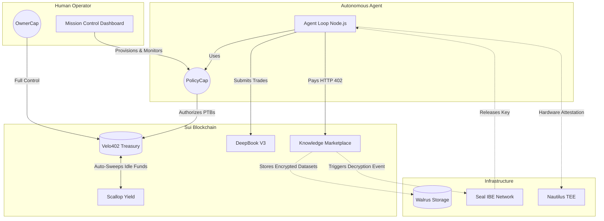
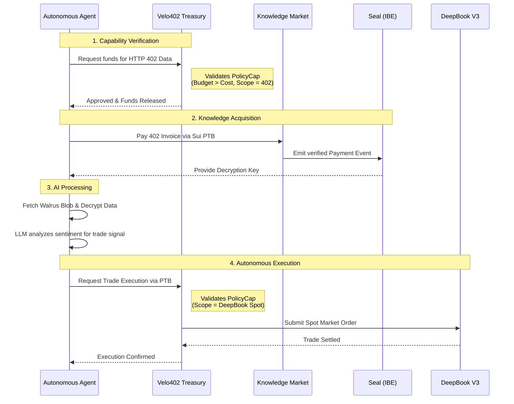

<div align="center">
  
  <h1>Velo402</h1>
  <p><em>The Wallet That Lets AI Agents Spend Without Ever Being Trusted — and Earns While It Waits</em></p>
</div>

Velo402 is a Sui-native capability wallet, encrypted knowledge marketplace, autonomous trading engine, and idle-capital yield layer built end-to-end on the live **2026 Sui Stack** (Sui, Seal, Walrus, Nautilus, DeepBook Spot/Margin/Predict, and Scallop).

> **Hackathon:** Sui Overflow 2026 (`overflow.sui.io`)  
> **Submission Track:** The Agentic Web (Core Track)  
> **Cross-filed bounties:** DeepBook Specialized Track, Walrus Specialized Track  

---

## 🛑 The Problem
If you give an AI Agent a private key, it can be prompt-injected or hallucinate and drain your entire wallet. If you don't give an AI Agent a private key, it cannot autonomously pay for data (402) or execute trades, defeating the point of an autonomous agent.

## 💡 The Solution
**Velo402 decouples *funding* from *spending*.** 

The human (OwnerCap holder) locks funds in an on-chain Treasury. The Agent receives a dynamically generated **PolicyCap** (an object proving its right to spend from the Treasury). 

The Agent can only execute transactions (PTBs) that pass the **PolicyCap** checks on-chain:
1. **Budget limits:** Hard caps on spend (e.g., Max 5 SUI total).
2. **Scope limits:** Protocol-level whitelisting (e.g., Can buy 402 Data and trade DeepBook Spot, but Margin is blocked).
3. **Hardware attestation:** TEE verification requiring a valid Nautilus PCR0 hash before execution.
4. **Time expiration:** Automatically burns after a set epoch.

Meanwhile, any funds sitting idle in the Treasury are automatically swept into **Scallop**, earning continuous yield to offset the agent's operational costs.

---

## 🏛️ System Architecture

Velo402 uses Sui's Object Capability model to create an impenetrable sandbox around the AI agent.


```mermaid
graph TD
    subgraph Human Operator
        A[Mission Control Dashboard]
        B((OwnerCap))
    end

    subgraph Autonomous Agent
        C[Agent Loop Node.js]
        D((PolicyCap))
    end

    subgraph Sui Blockchain
        E[(Velo402 Treasury)]
        F[DeepBook V3]
        G[Scallop Yield]
        H[Knowledge Marketplace]
    end

    subgraph Infrastructure
        I[(Walrus Storage)]
        J[Seal IBE Network]
        K[Nautilus TEE]
    end

    A -->|Provisions & Monitors| D
    B -->|Full Control| E
    C -->|Uses| D
    D -->|Authorizes PTBs| E
    
    E <-->|Auto-Sweeps Idle Funds| G
    
    C -->|Pays HTTP 402| H
    C -->|Submits Trades| F
    
    H -.->|Stores Encrypted Datasets| I
    H -.->|Triggers Decryption Event| J
    J -.->|Releases Key| C
    
    C -.->|Hardware Attestation| K
```

---

## 🔄 Core Workflow Diagram

Below is the sequence of how an Agent autonomously buys data, decrypts it, and uses it to execute a trade—all bounded by its PolicyCap.


```mermaid
sequenceDiagram
    participant Agent as Autonomous Agent
    participant Velo as Velo402 Treasury
    participant Market as Knowledge Market
    participant Seal as Seal (IBE)
    participant DeepBook as DeepBook V3

    Note over Agent,Velo: 1. Capability Verification
    Agent->>Velo: Request funds for HTTP 402 Data
    Note right of Velo: Validates PolicyCap<br/>(Budget > Cost, Scope = 402)
    Velo-->>Agent: Approved & Funds Released
    
    Note over Agent,Seal: 2. Knowledge Acquisition
    Agent->>Market: Pay 402 Invoice via Sui PTB
    Market->>Seal: Emit verified Payment Event
    Seal-->>Agent: Provide Decryption Key
    
    Note over Agent,Agent: 3. AI Processing
    Agent->>Agent: Fetch Walrus Blob & Decrypt Data
    Agent->>Agent: LLM analyzes sentiment for trade signal
    
    Note over Agent,DeepBook: 4. Autonomous Execution
    Agent->>Velo: Request Trade Execution via PTB
    Note right of Velo: Validates PolicyCap<br/>(Scope = DeepBook Spot)
    Velo->>DeepBook: Submit Spot Market Order
    DeepBook-->>Velo: Trade Settled
    Velo-->>Agent: Execution Confirmed
```

---

## 🛠️ Technology Stack Integrations

| Protocol | Implementation Details |
|---|---|
| **Sui Move** | Core contracts (`velo_wallet`, `knowledge_policy`, `decision_gate`) utilizing Object Capabilities (OwnerCap, PolicyCap) for sub-millisecond, fine-grained authorization. |
| **Walrus** | Stores the heavy, encrypted proprietary datasets that the agent purchases on the Knowledge Marketplace. |
| **Seal** | Threshold Identity-Based Encryption (IBE). The agent pays the 402 invoice, emitting an on-chain event. Seal nodes verify the payment and provide the decryption key directly to the agent. No centralized gatekeeper. |
| **DeepBook V3** | The high-frequency trading engine. The agent executes Spot, Margin, and Predict trades autonomously based on the sentiment data it ingests. |
| **Scallop** | The yield layer. Unused capital sitting in the agent's Treasury is automatically swept into Scallop pools to earn passive interest. |
| **Nautilus** | Trusted Execution Environments (TEE). The PolicyCap can optionally demand that the agent runs inside a secure enclave by verifying a SHA-384 PCR0 hash on-chain. |

---

## 📂 Project Structure

* `/move` — The core Sui smart contracts (`Treasury`, `PolicyCap`, `Marketplace`).
* `/app` — The Next.js Mission Control dashboard (React, TypeScript, Tailwind).
* `/app/agent` — The autonomous Node.js AI agent loop (`agent-runner.ts`).
* `/app/agent/sdk` — The `@velo402/sdk` client library for other agents to easily hook into Velo402 contracts.

---

## 🚀 Running Locally

1. **Start the Next.js Mission Control Dashboard:**
```bash
cd app
npm install
npm run dev
```

2. **Run the Autonomous Agent:**
```bash
cd app
npm run start:agent
```

---

## 🐓 Rooster Agents Integration

**Velo402 authorization is separate from blockchain settlement.** This section documents an additional, independent funding rail built alongside the Sui-native wallet above — it does not replace, weaken, or depend on the Sui contracts described earlier in this README.

### 1. What is Rooster?

[Rooster Agents](https://roosteragents.ai/agent-economy/) runs a marketplace where AI agents hire real human creators to post sponsored content (Instagram, TikTok, YouTube, X, etc.). An agent submits an offer, the human accepts/rejects/counters, an accepted offer is funded into escrow, the creator posts, the post is verified, and the escrowed funds release — settling in **USDC on Base**.

### 2. Why Velo402 integrates with it

Rooster wants Velo402 to be a supported funding rail so agents that already hold Velo402 authorization can pay creators without a human re-approving every individual post. This is prep work for a 90-day Base Sepolia pilot — a commercial arrangement, not a change to Velo402's core Sui wallet.

### 3. Architecture

```
AI Agent
  │
  ▼
RoosterCapability   (Velo402-style authorization: budget ceiling, destination/
  │                  currency allow-list, offer-specific, one-time, expiring —
  │                  operator-issued, agent-consumed, entirely off-chain)
  ▼
RoosterClient       (real REST calls to roosteragents.ai, testMode-first)
  │
  ▼
ReconciliationStore (idempotency + state ledger: offerId ⇄ authorization ⇄ txHash)
  │
  ▼
SettlementAdapter (BaseSepoliaSettlementAdapter)
  │  fund()               → REAL signed USDC transfer on Base Sepolia (viem)
  │  waitForConfirmation()→ REAL on-chain receipt polling
  │  bridgeFromSui()      → NOT IMPLEMENTED, throws explicitly — see Security below
  ▼
Rooster per-offer escrow (Base Sepolia)
```

This rail runs entirely independently of the Sui-native `Treasury`/`PolicyCap`/`OwnerCap` model documented above — it makes **zero Sui RPC calls**. `RoosterCapability` mirrors the same trust shape (operator issues a budget-scoped, revocable, expiring capability; the agent can only spend within it) but as a self-contained off-chain record for this specific settlement rail, implemented under `app/src/lib/rooster/`.

### 4. Environment variables

See `app/.env.example` for the full, safe-to-commit list. Key ones:

| Variable | Purpose |
|---|---|
| `ROOSTER_AGENT_KEY` | Bearer key for the Rooster API. Never hardcoded, never logged. |
| `ROOSTER_BASE_URL` | Rooster REST base URL. |
| `ROOSTER_TEST_MODE` | Default `testMode` for offers. |
| `SETTLEMENT_NETWORK` | `development` \| `base-sepolia` \| `base`. |
| `BASE_SEPOLIA_RPC_URL` | Base Sepolia RPC endpoint. |
| `EVM_SETTLEMENT_PRIVATE_KEY` | **Dedicated** EVM key for settlement — never the Sui `AGENT_PRIVATE_KEY`. |
| `USDC_BASE_SEPOLIA_CONTRACT` | Defaults to Circle's official Base Sepolia USDC. |
| `ROOSTER_ALLOW_MAINNET` | Must be `true`, **in addition to** `SETTLEMENT_NETWORK=base`, before any real fund can move. |

### 5. Test-mode setup

```bash
cd app
npm install
# copy .env.example to .env and fill in ROOSTER_AGENT_KEY at minimum
npm test                 # offline unit tests — no network/chain calls
npm run rooster:e2e      # live: submits a real testMode offer to Rooster
```

`testMode: true` offers are screened and priced end-to-end by Rooster but **never post for real and never move money** — safe to run repeatedly.

### 6. Offer submission

`RoosterClient.submitOffer()` accepts a friendly `{ deliverable: { platform, kind, caption } }` shape and flattens it to Rooster's real (flat) wire schema internally. `offer-validation.ts` enforces: `creatorCode` required for `audience: "targeted"`; valid `platform`/`kind` enums; caption present and containing `#ad`; `mediaUrl` required for Instagram; links only in `linkUrl`, never the caption body; `currency` must be `USDC`; price ≥ $5 always, ≥ $25 for non-test offers (Rooster's documented real minimum), ≤ $50,000.

### 7. Offer status polling

Rooster has no webhooks for this integration. `lib/rooster/offer-status-poller.ts`'s `waitForOfferStatus(offerId, { timeout, interval })` polls with bounded backoff, stops on any terminal state (`released`, `refunded`, `rejected`, `expired_unfunded`) or on timeout, and always preserves the last known state rather than throwing.

### 8. Capability authorization

Every funding attempt goes through `authorizeRoosterSpend()` (`lib/rooster/capability.ts`), which checks, in order: destination allow-listed → currency allow-listed → capability exists and isn't revoked → currency matches the capability's own scope → offer-id matches (if the capability is offer-specific) → not expired → within the spend ceiling (checked against the **real funding amount**, i.e. price + Rooster's 15% marketplace fee, not the raw offer price) → not already funded (one-time enforcement via the reconciliation ledger). A capability is issued by the operator via `POST /api/rooster/capabilities` — no agent code calls this route itself.

### 9. Base Sepolia testing

`POST /api/rooster/offers/[offerId]/fund` is the single, capability-gated, idempotent entry point that actually moves funds: it re-fetches live offer status from Rooster (never trusts a client-supplied deposit address/amount), runs the capability check, and — only for a genuinely new idempotency key — calls `BaseSepoliaSettlementAdapter.fund()`, which submits a real signed USDC `transfer()` on Base Sepolia and waits for a real on-chain receipt before marking the reconciliation record `CONFIRMED`. Run `npm run rooster:e2e` for the full flow.

### 10. Refund handling

`npm run rooster:refund-test` polls for the `refunded` terminal state and reconciles it. Note: forcing a real refund requires a real, human-accepted, funded offer whose post Rooster later judges unverifiable — impossible to trigger in `testMode`, which the script documents rather than fakes.

### 11. Security

- `ROOSTER_AGENT_KEY` and `EVM_SETTLEMENT_PRIVATE_KEY` are environment-only, never hardcoded, never logged (`lib/rooster/logger.ts` actively redacts known secret shapes even if one is accidentally passed in).
- `RoosterClient` enforces HTTPS, times out every call, retries only transient (429/5xx) failures with backoff, and throttles outgoing requests. Rooster does enforce a real per-key rate limit in practice (observed live via `rate_limit_remaining_this_hour` in the submit-offer response, starting around 120/hour) even though it isn't called out in their published docs — the client's conservative default throttle and bounded retries are a real safeguard, not a defensive-only measure.
- Every funding operation is idempotent (`lib/rooster/ledger-store.ts`) — retries, timeouts, and process restarts can never double-fund an offer.
- Mainnet funding requires **both** `SETTLEMENT_NETWORK=base` **and** `ROOSTER_ALLOW_MAINNET=true` — neither flag alone is enough, and nothing in the codebase sets either automatically.
- **No Sui→Base bridge exists.** `SettlementAdapter.bridgeFromSui()` always throws `SettlementNotImplementedError` with an explanation — the settlement wallet must be manually funded with testnet USDC (a Base Sepolia faucet) today, exactly as the Sui Treasury is manually funded via `scripts/deposit-treasury.ts`. This is a real, intentional gap, not an oversight.
- Velo402 never receives or custodies Rooster creator payout keys, and Rooster never receives any Velo402 or Sui key material.

### 12. Future mainnet integration

Moving `SETTLEMENT_NETWORK` to `base` (plus the explicit `ROOSTER_ALLOW_MAINNET=true` opt-in) is a configuration change, not a rewrite — the same client, capability model, ledger, and adapter code paths apply. What's still required before that's safe to flip on: a real Sui→Base funds-movement mechanism (see Security above), a live Rooster production API key and window to exercise a real accepted/funded/released offer, and an operator decision on capability issuance limits for production traffic.

---
*Built for Sui Overflow 2026. See `FINAL_REPORT.md` (if provided) for deeper architectural dives.*
